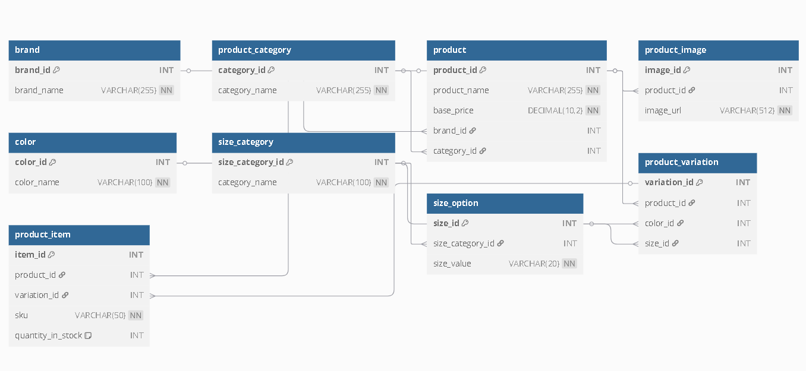

# ecommerce-database

A relational database schema designed for a scalable e-commerce platform, supporting brands, product categories, product variations (color/size), and inventory management.

## Database Structure

The schema includes the following tables:

- **`brand`**: Stores brands like Nike, Apple.
- **`product_category`**: High-level product categories like Electronics, Clothing.
- **`product`**: Main product information.
- **`product_image`**: URLs for product images.
- **`color`**: Available color options.
- **`size_category`**: Size groups like Clothing Sizes, Shoe Sizes.
- **`size_option`**: Specific size values (S, M, L, etc.).
- **`product_variation`**: Combines color and size options for products.
- **`product_item`**: Final purchasable stock keeping units (SKUs) with inventory tracking.

## ERD

